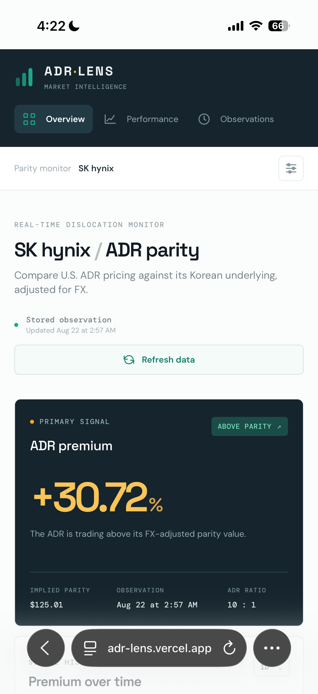

# ADR Lens

### Cross-Market ADR Parity & Dislocation Intelligence

ADR Lens is a market-intelligence system for identifying, measuring, and tracking pricing dislocations between U.S.-listed American Depositary Receipts (ADRs) and their underlying foreign-listed shares.

**Live application:** https://adr-lens.vercel.app

## Dashboard



---

## Overview

A security trading in two different markets does not necessarily trade at the same economically equivalent price at the same moment.

Different trading hours, currencies, liquidity conditions, investor bases, information flows, and ADR conversion ratios can create meaningful differences between the market price of an ADR and the implied value of its underlying foreign shares.

ADR Lens converts those differences into a measurable signal.

Rather than comparing two nominal security prices, the system normalizes the foreign listing for:

- ADR conversion ratio
- Foreign exchange rates
- Local-market share price
- U.S. ADR price
- Observation time

It then calculates the ADR's **FX-adjusted implied parity value** and measures the premium or discount at which the U.S. security is trading relative to that value.

The initial implementation focuses on **SK hynix**, providing a framework for studying the relationship between its Korean-listed shares and U.S. ADR pricing.

---

## Why This Exists

Most market dashboards answer questions such as:

> What is this security trading at?

ADR Lens is designed to answer a different question:

> What *should* this security be worth relative to the same economic exposure trading in another market?

That distinction matters.

Cross-listed securities exist inside a fragmented global market structure. Their prices are influenced not only by the underlying company, but also by currency movements, market hours, liquidity, local order flow, ADR mechanics, and differences in information incorporation between venues.

A raw price comparison therefore tells very little.

ADR Lens creates a common economic basis between the two listings and continuously measures the resulting dislocation.

The goal is not simply to display market data.

The goal is to transform cross-market pricing relationships into structured, observable information.

---

## Core Calculation

Let:

- `P_local` = price of one underlying foreign share in local currency
- `FX` = local currency units per U.S. dollar
- `R` = number of underlying shares represented by one ADR
- `P_ADR` = market price of the U.S.-listed ADR

The implied U.S. parity value is:

```text
Parity Value = (P_local × R) / FX
```

The ADR premium or discount is then:

```text
Premium (%) = ((P_ADR / Parity Value) - 1) × 100
```

A positive value indicates that the ADR is trading **above FX-adjusted parity**.

A negative value indicates that the ADR is trading **below FX-adjusted parity**.

### Example

If the foreign listing trades at:

```text
₩173,000
```

the ADR represents:

```text
10 underlying shares
```

and USD/KRW is:

```text
1,383.90
```

then:

```text
Parity Value
= (173,000 × 10) / 1,383.90
≈ $125.01
```

If the ADR trades at approximately:

```text
$163.66
```

then:

```text
Premium
≈ ((163.66 / 125.01) - 1) × 100
≈ +30.9%
```

ADR Lens performs this normalization automatically.

---

## What ADR Lens Measures

The dashboard currently surfaces:

- Live ADR market price
- Foreign underlying share price
- USD/local-currency FX rate
- ADR conversion ratio
- FX-adjusted implied parity value
- ADR premium or discount
- Premium direction
- Observation timestamp
- Historical premium observations
- Cross-market signal state

Together, these values describe not merely where the ADR trades, but **how its valuation relates to the underlying foreign security**.

---

## Signal Interpretation

ADR Lens treats the premium/discount as a dynamic market relationship rather than a static number.

The system can classify changes in the dislocation as:

```text
EXPANDING
COMPRESSING
ABOVE PARITY
BELOW PARITY
```

This makes it possible to distinguish between a large premium that is stable and one that is actively widening or converging.

That distinction becomes increasingly useful as historical observations accumulate.

---

## Live Market Data

The web application can request a fresh market snapshot and recalculate the parity relationship using current market data.

The data pipeline normalizes:

```text
U.S. ADR Price
        +
Foreign Share Price
        +
FX Rate
        +
ADR Ratio
        ↓
FX-Adjusted Parity
        ↓
Premium / Discount
        ↓
Dislocation Signal
```

The interface then updates the resulting market state.

---

## Historical Intelligence

Individual observations provide a snapshot.

A time series provides context.

ADR Lens stores premium observations so that the current dislocation can eventually be evaluated against its own historical behavior.

This enables analysis such as:

- premium expansion and compression
- historical premium ranges
- mean premium behavior
- extreme dislocation events
- convergence toward parity
- persistence of structural premiums
- regime changes in cross-market pricing

As the dataset grows, the system becomes increasingly useful for distinguishing ordinary cross-market differences from unusual pricing behavior.

---

## Architecture

ADR Lens combines a lightweight quantitative research pipeline with a production web interface.

```text
                Market Data
                    │
        ┌───────────┴───────────┐
        │                       │
   U.S. ADR Data          Foreign Market Data
        │                       │
        └───────────┬───────────┘
                    │
                  FX Data
                    │
                    ▼
            Normalization Layer
                    │
                    ▼
          ADR Parity Calculation
                    │
                    ▼
       Premium / Discount Engine
                    │
          ┌─────────┴─────────┐
          │                   │
          ▼                   ▼
 Historical Storage      Live API
          │                   │
          └─────────┬─────────┘
                    ▼
             Next.js Dashboard
                    │
                    ▼
             Vercel Production
```

---

## Technology Stack

### Quantitative / Data Layer

- Python
- Market-data retrieval
- CSV-based historical observations
- FX normalization
- ADR parity calculations

### Application Layer

- JavaScript
- React
- Next.js
- Server-side API routes

### Infrastructure

- Git
- GitHub
- GitHub Actions
- Vercel
- Automated production deployment

---

## Repository Structure

```text
adr-lens/
│
├── app/
│   ├── api/
│   │   └── market/
│   │       └── route.js
│   └── page.jsx
│
├── lib/
│   └── market-data.js
│
├── adr_lens.py
├── premium_history.csv
├── package.json
├── package-lock.json
├── next.config.mjs
└── README.md
```

`adr_lens.py` contains the original quantitative implementation.

`lib/market-data.js` provides the market-data and parity logic used by the production web application.

`app/api/market/route.js` exposes the live calculation pipeline to the dashboard.

`premium_history.csv` stores historical observations used for longitudinal analysis.

---

## Running Locally

Install dependencies:

```bash
npm install
```

Start the development server:

```bash
npm run dev
```

The original Python implementation can also be executed independently:

```bash
python adr_lens.py
```

---

## Production

ADR Lens is deployed through Vercel with the production application connected to the repository's `main` branch.

Changes pushed to the production branch can be automatically built and deployed.

Production application:

**https://adr-lens.vercel.app**

---

## Roadmap

ADR Lens currently demonstrates the core cross-market parity engine using SK hynix.

The underlying concept is designed to extend beyond a single security.

Potential future development includes:

- Multi-ADR monitoring
- Cross-listed equity screening
- Historical premium distributions
- Rolling mean and standard-deviation analysis
- Dislocation z-scores
- Fair-value ladders
- Premium/discount alerts
- Market-session awareness
- Stale-price detection
- Additional FX normalization
- Relative-return attribution
- Cross-market lead/lag analysis
- Automated anomaly detection
- Broader arbitrage and relative-value screening

The long-term objective is to evolve the project from a single ADR monitor into a broader **cross-market dislocation intelligence system**.

---

## Research Considerations

A measured ADR premium or discount should not automatically be interpreted as risk-free arbitrage.

Observed dislocations may reflect:

- non-overlapping market hours
- stale underlying prices
- FX movement
- ADR creation/redemption constraints
- settlement differences
- liquidity
- transaction costs
- taxes or fees
- short-sale constraints
- market-specific risk
- differing investor demand

These factors are important when interpreting apparent deviations from parity.

ADR Lens is therefore designed as a **measurement and research system**, not as an assumption that every observed spread is immediately tradeable.

---

## Project Philosophy

Markets are globally connected, but price discovery remains fragmented.

Two instruments representing closely related economic exposure can trade in different currencies, jurisdictions, sessions, and liquidity environments. The resulting differences contain information that is lost when each security is analyzed independently.

ADR Lens was built around a simple principle:

> **Price is observable. Relative value requires context.**

The system attempts to provide that context by converting cross-market relationships into measurable data.

---

## Disclaimer

ADR Lens is an independent research and software project intended for informational and educational purposes only.

Market data may be delayed, incomplete, or inaccurate. Nothing presented by the application constitutes investment advice, a recommendation, or a representation that an observed pricing difference is executable or arbitrageable.

Always independently verify market data and trading conditions.
